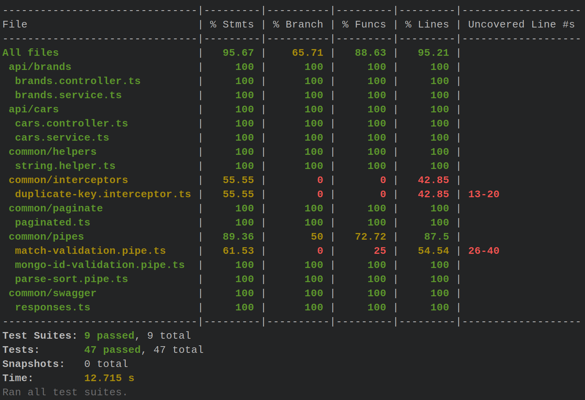

## Example Cars-Brand (nestjs + mongoose)


>Разработать клиент-серверное решение с использованием typescript и node.js для хранения и
>
>управления базой данных автомобилей различных брендов.
>
>Решение должно состоять из двух приложений: серверного и клиентского. В приложениях должны быть использованы следующие технологии:
>
>Серверное приложение:
>
>1. Node.JS
>2. TypeScript
>3. Express или любой express-совместимый web-сервер
>4. REST API
>5. Методы, которые позволяют добавлять автомобили, удалять и получать список с сортировкой. Опубликовать эти методы в REST API
>
>6А. Информацию об автомобилях хранить в виде JSON файла на диске. Учесть необходимость защиты от одновременной записи файла при запросах к REST API
>
>6Б. Альтернатива п.6А, при выборе будет дополнительным плюсом кандидату: БД MongoDB для персистентного хранения информации об автомобилях. В качестве сервера MongoDB выбрать любой на своё усмотрение, можно публичный MongoDB Atlas

### Requirements

`docker docker-compose make node19 yarn`

### Launch

```shell 
make up # up mongodb container 27017 default port mapping
```

```shell
yarn start # http://localhost:3000 
```


### Tests

```shell
yarn test:e2e # e2e tests
```

```shell
yarn test # unit tests
```

```shell
yarn test:cov # coverage
```

